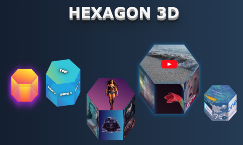

# hexagon-3d
A small service for providing styles object for CSS-based 3d hexagons with high interactivity capabilities. You may use these shapes as skeletons for various animations, images adding, videos playing, combining them into different forms, and doing a lot of other things. The capabilities of hexagons will be growing over time.

If you are building your project with React you can use React component wrapper for the hexagon service which provides a graphical HTML part out of the box: [<b>hexagon-3d-react</b>](https://www.npmjs.com/package/hexagon-3d-react)

### Live demo:

[<b>Hexagon3D</b>](https://hexagon.metriker.com/)

### Explanation tutorial

You can read more about hexagon geometry, construction features, and package details in my [<b>Medium article</b>](https://medium.com/better-programming/entertaining-web-geometry-building-an-interactive-3d-css-hexagon-a9b5f535d06e).

## Installation

`npm install hexagon-3d`

## Usage

`import hexagon3D from 'hexagon-3d';`

or 

`const hexagon3D = require('hexagon-3d').default`;

After importing hexagon service is ready to be used:

`const hexagonData = hexagon3D({<parameters>})`;

Returned parameters than can be used to build an HTML structure for hexagon sides.

### Example of usage

    `

        

            {topChildren}
        

        

            {side1Children}
        

        

            {side2Children}
        

        

            {side3Children}
        

        

            {side4Children}
        

        

            {side5Children}
        

        

            {side6Children}
        

        

            {bottomChildren}
        

    `

    
  ### Parameters
  
  | Name           | Type    | Description                                                                                                  | Values      |
  |----------------|---------|--------------------------------------------------------------------------------------------------------------|-------------|
  | width          | number  | Width of the hexagon (the biggest distance of it's 2 opposite points)                                        | any         |
  | height         | number  | Height of the hexagon sides                                                                                  | any         |
  | rotateZ        | number  | Rotation degrees round Z axis                                                                                | 0-360       |
  | rotateX        | number  | Rotation degrees round X axis                                                                                | 0-360       |
  | showShadow     | boolean | Flag to indicate whether faces border shadow should be shown (default - false)                               | true, false |
  | shadowColor    | string  | Color of a faces border shadow                                                                               | any         |
  | growTop        | boolean | Flag which indicates how hexagone should change it's height - to the top or to the bottom. (default - false) | true, false |
  | topBottomColor | string  | Color of hexagon top and bottom sides                                                                        | any         |
  | sidesColor     | string  | Color of hexagon sides                                                                                       | any         |
  | opacity        | number  | Opacity of hexagon sides                                                                                     | 0.0 - 1.0   |
  | showTransition | boolean | Indicate whether height change animation should be shown (default - false)                                   | true, false |
  
  ### Next iterations
  
  * Add tooltips for each side
  * Add more styling capabilities
  * Add rotations and other animation effects
  * Add deeper sides interactions
  * Optimize CSS properties